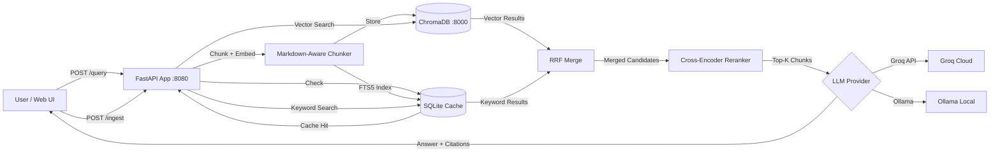

# RAG Service — Anthropic Claude Documentation

A containerized Retrieval-Augmented Generation (RAG) service that answers questions about Anthropic Claude documentation with source citations. Features hybrid search (vector + keyword), cross-encoder reranking, query caching, and automatic corpus ingestion on startup.

## Architecture



```
┌──────────────┐     ┌───────────────────────────────────────────────────────┐     ┌──────────────┐
│              │     │                FastAPI App (:8080)                    │     │              │
│  User / UI   │────▶│                                                       │────▶│  ChromaDB    │
│              │     │  /ingest  → Chunker → Embedder → Store + FTS5 Index  │     │  (:8000)     │
│              │◀────│  /query   → Cache Check → Hybrid Retrieve → Rerank   │◀────│              │
│              │     │             → LLM Generate → Cache Store → Respond   │     │              │
│              │     │  /health  → Status Check                             │     │              │
└──────────────┘     └──────────────┬──────────────┬────────────────────────┘     └──────────────┘
                                    │              │
                          ┌─────────┴────┐   ┌─────┴──────┐
                          │              │   │            │
                    ┌─────▼─────┐  ┌─────▼──────┐  ┌─────▼──────┐
                    │ Groq API  │  │  Ollama    │  │  SQLite    │
                    │ (default) │  │  (local)   │  │  Cache+FTS │
                    └───────────┘  └────────────┘  └────────────┘
```

### Query Pipeline Detail

1. **Cache check** — SHA256 hash lookup in SQLite; if hit, return immediately
2. **Hybrid retrieval** — Top-20 results from vector search (ChromaDB) + Top-20 from FTS5 keyword search (SQLite)
3. **RRF merge** — Reciprocal Rank Fusion (k=60) combines both result sets, boosting chunks found by both methods
4. **Cross-encoder reranking** — `ms-marco-MiniLM-L-6-v2` scores each (question, chunk) pair, selects final top-k
5. **LLM generation** — Groq or Ollama generates answer grounded in the reranked context
6. **Cache store** — Response is cached for future identical queries

## Quick Start

### Prerequisites
- Docker and Docker Compose
- A free [Groq API key](https://console.groq.com) (or use Ollama for fully local setup)

### Setup

```bash
# 1. Clone and enter the project
git clone <repo-url>
cd simple-rag

# 2. Configure environment
cp .env.example .env
# Edit .env and add your GROQ_API_KEY

# 3. The corpus is already included in the repo (corpus/anthropic/).
#    Only run this if the files are missing or you want to re-download:
# pip install httpx
# python scripts/download_corpus.py

# 4. Start the services (auto-ingests corpus on first startup)
docker compose up --build

# 5. Open the web UI
open http://localhost:8080

# 6. Or query via API
curl -X POST http://localhost:8080/query \
  -H "Content-Type: application/json" \
  -d '{"question": "What is the context window for Claude Opus 4.7?"}'
```

> **Note:** Manual ingestion is not needed on first startup. The service automatically detects an empty ChromaDB collection and ingests from `corpus/anthropic/`. On subsequent restarts, it skips ingestion since data already exists. If you update the corpus files or want to re-ingest with different chunk parameters, you can either re-ingest manually or do a clean rebuild. When using the `/ingest` endpoint, omit `chunk_size`/`chunk_overlap` to use the `.env` defaults (`CHUNK_SIZE` and `CHUNK_OVERLAP`), or pass them explicitly to override:
>
> ```bash
> # Option 1: Manual re-ingest with custom chunk settings
> curl -X POST http://localhost:8080/ingest \
>   -H "Content-Type: application/json" \
>   -d '{"folder_path": "/app/corpus/anthropic", "chunk_size": 1024, "chunk_overlap": 100}'
>
> # Option 2: Clean rebuild (removes all data and re-ingests on startup with defaults)
> docker compose down -v
> docker compose up --build
> ```

### Fully Local Setup (No API Key)

```bash
# Use Ollama instead of Groq
# Edit .env: set LLM_PROVIDER=ollama

docker compose --profile local up --build

# The build downloads the Ollama server (~4GB) but does not include an LLM model.
# Pull the model before making any queries:
docker compose exec ollama ollama pull llama3.2:3b
```

> **Note:** Switching `LLM_PROVIDER` in `.env` requires a rebuild for the change to take effect. Use `--profile local` when switching to Ollama so the Ollama container is included:
> ```bash
> docker compose down
> docker compose up --build                          # Groq
> docker compose --profile local up --build          # Ollama
> ```

## API Endpoints

| Endpoint | Method | Description |
|----------|--------|-------------|
| `/health` | GET | Service status, ChromaDB connection, document counts |
| `/ingest` | POST | Ingest documents from a folder path |
| `/query` | POST | Ask a question, get answer with source citations |

### POST /ingest
```json
{
  "folder_path": "corpus/anthropic",
  "chunk_size": 1024,
  "chunk_overlap": 100
}
```
`chunk_size` and `chunk_overlap` are optional — omit them to use the `.env` defaults (512 and 50).

### POST /query
```json
{
  "question": "What is Claude?"
}
```
`top_k` is controlled via the `TOP_K` environment variable (default: 5).

Response includes answer with source citations, chunk IDs, relevance scores, and `retrieval_method` indicating whether each source was found via `"vector"`, `"keyword"`, or `"vector & keyword"` search.

```json
{
  "answer": "Claude is...",
  "sources": [
    {
      "chunk_id": "overview.md::Overview::chunk_0",
      "source_file": "overview.md",
      "section": "Overview",
      "relevance_score": 0.8721,
      "retrieval_method": "vector & keyword",
      "text_preview": "Claude is an AI assistant made by Anthropic..."
    }
  ],
  "model": "meta-llama/llama-4-scout-17b-16e-instruct",
  "provider": "groq"
}
```

## Design Decisions

### Chunking Strategy: Markdown-Aware Two-Stage Splitting
**Choice**: `MarkdownHeaderTextSplitter` → `RecursiveCharacterTextSplitter`
**Why**: The corpus is primarily Markdown documentation. Splitting on headers first preserves logical document structure and creates semantically meaningful sections. The second stage handles sections that exceed the chunk size limit. Chunk IDs encode the file name and header path for precise citations.
**Tradeoff**: More complex than simple fixed-size chunking, but produces higher-quality chunks with meaningful metadata (header hierarchy for citations).

### Hybrid Search: Vector + FTS5 Keyword Search
**Choice**: ChromaDB cosine similarity + SQLite FTS5, merged via Reciprocal Rank Fusion (RRF)
**Why**: Vector search captures semantic similarity but can miss exact keyword matches (model names, specific numbers, API parameter names). FTS5 keyword search handles exact term matching. RRF merges both ranked lists without needing tuned weights — chunks found by both methods get naturally boosted.
**Tradeoff**: Adds a SQLite dependency (already present for query caching) and slightly increases retrieval latency, but significantly improves recall for technical queries.

### Reranking: Cross-Encoder
**Choice**: `cross-encoder/ms-marco-MiniLM-L-6-v2` reranks the merged candidate pool
**Why**: Bi-encoder embeddings (used for initial retrieval) are fast but approximate. Cross-encoders jointly encode the (question, document) pair and produce more accurate relevance scores. Running it on the merged top-20 candidates (not the full corpus) keeps latency acceptable.
**Tradeoff**: ~6MB model adds to Docker image size and adds ~100ms per query. Worth it for precision improvement.

### Query Caching: SQLite
**Choice**: SHA256-keyed cache in SQLite, persisted via Docker volume
**Why**: Identical questions return instantly without hitting the LLM. SQLite is zero-dependency (Python stdlib), file-based (survives container restarts via volume), and thread-safe. The same SQLite database also serves the FTS5 keyword index.
**Tradeoff**: No TTL/eviction — cache grows indefinitely. Acceptable for this corpus size. Cache is cleared on re-ingestion.

### LLM: Groq Free Tier (Default) + Ollama Fallback
**Choice**: Configurable via `LLM_PROVIDER` environment variable
**Why**: Groq provides fast inference with large models at no cost. Ollama provides a fully local alternative for offline use. Supporting both shows versatility without over-engineering.
**Tradeoff**: Groq requires internet connectivity and has rate limits (30 RPM). Ollama is slower on CPU but fully offline.

### Embeddings: all-MiniLM-L6-v2 via sentence-transformers
**Choice**: In-process embedding model, no separate service
**Why**: At ~90MB, this model loads fast, produces 384-dimensional embeddings, and runs efficiently on CPU. Pre-downloaded at Docker build time for instant startup. No dependency on Ollama or external APIs for embeddings.
**Tradeoff**: Smaller model = lower embedding quality than 768d models like nomic-embed-text. Acceptable for this corpus size.

### Vector Store: ChromaDB
**Choice**: ChromaDB in server mode (separate Docker container)
**Why**: Simplest setup among the options (ChromaDB, Qdrant, Weaviate). Clean Python API, built-in cosine similarity, good enough for <10K chunks.
**Tradeoff**: Less production-ready than Qdrant for large-scale deployments, but ideal for this scope.

### Auto-Ingestion on Startup
**Choice**: Automatic corpus ingestion when ChromaDB collection is empty
**Why**: `docker compose up` should produce a fully working, queryable system with no extra steps. The service checks ChromaDB on startup — if no chunks exist, it ingests from `corpus/anthropic/`. On subsequent restarts, it skips ingestion since data persists in Docker volumes.
**Tradeoff**: First startup takes longer (~30s for embedding + storing). Acceptable since it only runs once.

## Evaluation

Two evaluation runs were performed with different judge models:
- `eval/report-meta-llama-llama-4-scout-17b-16e-instruct--llama-3.3-70b-versatile.md` — Scout generation + 70B judge
- `eval/report-meta-llama-llama-4-scout-17b-16e-instruct.md` — Scout generation + Scout judge

```bash
# Run evaluation (requires the service to be running)
pip install -r requirements-eval.txt
python eval/run_eval.py && python eval/report_generator.py
```

> **Note (Linux):** Most Linux distributions block global pip installs. Create a virtual environment first:
> ```bash
> python3 -m venv venv && source venv/bin/activate
> ```

> **Note:** Step 1 (RAG response collection) uses whichever LLM provider is set in `.env` (`groq` or `ollama`). Step 2 (evaluation metrics) always requires a Groq API key — DeepEval uses Groq's OpenAI-compatible endpoint as the LLM judge, regardless of `LLM_PROVIDER`. Even fully local setups need a valid `GROQ_API_KEY` in `.env` to run evaluation.

The evaluation dataset (`eval/dataset.json`) contains 22 question-answer pairs across 4 categories:
- **Factual** (10): Direct lookups with clear answers
- **Multi-hop** (5): Require synthesizing info from multiple chunks
- **No-answer** (4): Test hallucination resistance
- **Paraphrased** (3): Same questions asked differently

Metrics are computed using DeepEval with Groq as the LLM judge:
- **Faithfulness**: Is the answer grounded in the retrieved context?
- **Answer Relevancy**: Does the answer address the question?
- **Context Precision**: Are the retrieved chunks relevant?
- **Context Recall**: Were all needed chunks retrieved?
- **Answer Correctness**: Does the answer match the ground truth? (GEval)

## Configuration

All parameters are configurable via environment variables (`.env`):

| Parameter | Default | Description |
|-----------|---------|-------------|
| `LLM_PROVIDER` | `groq` | LLM backend: `groq` or `ollama` |
| `GROQ_API_KEY` | — | Groq API key (free tier) |
| `GROQ_MODEL` | `meta-llama/llama-4-scout-17b-16e-instruct` | Groq model to use |
| `OLLAMA_MODEL` | `llama3.2:3b` | Ollama model to use |
| `EMBEDDING_MODEL` | `all-MiniLM-L6-v2` | Sentence-transformers embedding model |
| `CHUNK_SIZE` | `512` | Chunk size in characters |
| `CHUNK_OVERLAP` | `50` | Overlap between chunks |
| `TOP_K` | `5` | Number of chunks returned after reranking |

`CHUNK_SIZE` and `CHUNK_OVERLAP` can be overridden per-request via `/ingest`. `TOP_K` is set via the environment variable only.

## Known Limitations

- **Table chunking splits**: Pricing and specification tables in Markdown get split across chunks, which can cause the LLM to associate the wrong value with the wrong model (e.g., returning Haiku 3.5 pricing when asked about Haiku 4.5). This was the most common failure pattern in evaluation.
- **No retrieval confidence threshold**: The retriever always returns top-k chunks even when no relevant content exists in the corpus. For unanswerable questions, this means irrelevant context is passed to the LLM, reducing answer relevancy scores.
- **Context window framing**: The `context-windows.md` chunk describes Opus 4.7's 1M context as an "extended" feature, which misled the LLM into framing it as non-default in multiple evaluation questions.
- **Groq rate limits**: 30 RPM on free tier slows batch evaluation; sleep delays are required between API calls during eval runs.
- **No streaming**: Responses are returned as a complete JSON payload, not streamed via SSE.
- **Cache has no TTL**: Cached responses persist indefinitely until cleared by re-ingestion.
- **FTS5 keyword search**: Uses simple term splitting with OR matching — no stemming, no query expansion, no phrase matching.
- **Evaluation requires Groq**: The eval pipeline uses DeepEval with Groq's OpenAI-compatible API as the LLM judge. Even fully local setups (Ollama) need a Groq API key to run evaluation.

## What I Would Improve

1. **Table-aware chunking**: The most impactful change. Pricing and model comparison tables get split across chunks, causing wrong values to be returned (3 of 22 eval questions failed due to this). Keeping full tables within a single chunk or adding per-row metadata (which model each price belongs to) would fix the most common failure mode.
2. **Retrieval confidence threshold**: Currently top-k chunks are always returned regardless of relevance. Adding a minimum similarity score cutoff would filter out noise for unanswerable questions, where the retriever currently passes irrelevant context that lowers answer quality.
3. **System prompt for ambiguous context**: The LLM sometimes picks batch pricing over standard pricing, or treats optional features as defaults. Adding explicit guidance like "prefer standard values unless the user asks about a specific variant" would reduce misinterpretation.
4. **Streaming responses**: Add an SSE endpoint for real-time answer streaming — currently the full response is generated before returning, which adds perceived latency on slower models.
5. **Corpus expansion**: Evaluation revealed a gap in extended thinking documentation. The corpus covers 10 Anthropic doc pages; adding pages on extended thinking, prompt caching, and the Messages API reference would improve coverage for multi-hop questions.
6. **Query expansion**: Use the LLM to rewrite ambiguous or paraphrased queries before retrieval. Evaluation showed paraphrased questions scored lower than factual ones, suggesting the retriever struggles with alternative phrasings.
7. **Local evaluation support**: Wire DeepEval to use Ollama as the LLM judge so the entire pipeline (RAG + evaluation) can run fully offline without a Groq API key.

## Project Structure

```
├── src/
│   ├── main.py              # FastAPI app, auto-ingest on startup
│   ├── config.py            # Configuration (pydantic-settings)
│   ├── api/                 # REST API endpoints (ingest, query, health)
│   ├── core/                # Core logic
│   │   ├── chunker.py       # Markdown-aware two-stage chunking
│   │   ├── embedder.py      # Sentence-transformers embeddings
│   │   ├── vectorstore.py   # ChromaDB vector store
│   │   ├── rag.py           # RAG pipeline with hybrid search + RRF
│   │   ├── reranker.py      # Cross-encoder reranking
│   │   ├── cache.py         # SQLite query cache + FTS5 keyword index
│   │   └── llm.py           # LLM providers (Groq + Ollama)
│   ├── models/              # Pydantic schemas
│   └── static/              # Web UI
├── corpus/anthropic/        # Documentation corpus
├── eval/                    # Evaluation dataset, runner, reports
├── scripts/                 # Corpus download, data seeding
├── tests/                   # Unit tests
├── docker-compose.yml       # Container orchestration (app + ChromaDB; Ollama with --profile local)
├── Dockerfile               # App container with pre-downloaded models
└── docs/claude-code-session/ # AI-assisted workflow transcript
```
