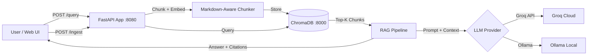

# RAG Service — Anthropic Claude Documentation

A containerized Retrieval-Augmented Generation (RAG) service that answers questions about Anthropic Claude documentation with source citations.

## Architecture



```
┌──────────────┐     ┌─────────────────────────────────────────┐     ┌──────────────┐
│              │     │            FastAPI App (:8080)           │     │              │
│  User / UI   │────▶│                                         │────▶│  ChromaDB    │
│              │     │  /ingest → Chunker → Embedder → Store   │     │  (:8000)     │
│              │◀────│  /query  → Embed → Retrieve → LLM → Cite│◀────│              │
│              │     │  /health → Status Check                 │     │              │
└──────────────┘     └──────────────┬──────────────────────────┘     └──────────────┘
                                    │
                          ┌─────────┴─────────┐
                          │                   │
                    ┌─────▼─────┐      ┌──────▼─────┐
                    │ Groq API  │      │  Ollama    │
                    │ (default) │      │  (local)   │
                    └───────────┘      └────────────┘
```

## Quick Start

### Prerequisites
- Docker and Docker Compose
- A free [Groq API key](https://console.groq.com) (or use Ollama for fully local setup)

### Setup

```bash
# 1. Clone and enter the project
git clone <repo-url>
cd hackaton

# 2. Configure environment
cp .env.example .env
# Edit .env and add your GROQ_API_KEY

# 3. Download the documentation corpus
pip install httpx
python scripts/download_corpus.py

# 4. Start the services
docker compose up --build

# 5. Ingest the corpus
curl -X POST http://localhost:8080/ingest \
  -H "Content-Type: application/json" \
  -d '{"folder_path": "corpus/anthropic"}'

# 6. Ask a question
curl -X POST http://localhost:8080/query \
  -H "Content-Type: application/json" \
  -d '{"question": "What is the context window for Claude Opus 4.7?"}'

# 7. Open the web UI
open http://localhost:8080
```

### Fully Local Setup (No API Key)

```bash
# Use Ollama instead of Groq
# Edit .env: set LLM_PROVIDER=ollama

docker compose --profile local up --build

# Pull the model (first time only)
docker compose exec ollama ollama pull llama3.2:3b
```

## API Endpoints

| Endpoint | Method | Description |
|----------|--------|-------------|
| `/health` | GET | Service status, ChromaDB connection, document counts |
| `/ingest` | POST | Ingest documents from a folder path |
| `/query` | POST | Ask a question, get answer with source citations |

### POST /ingest
```json
{
  "folder_path": "corpus/anthropic",
  "chunk_size": 512,
  "chunk_overlap": 50
}
```

### POST /query
```json
{
  "question": "What is Claude?",
  "top_k": 5
}
```

Response includes answer with source citations and chunk IDs.

## Design Decisions

### Chunking Strategy: Markdown-Aware Two-Stage Splitting
**Choice**: `MarkdownHeaderTextSplitter` → `RecursiveCharacterTextSplitter`
**Why**: The corpus is primarily Markdown documentation. Splitting on headers first preserves logical document structure and creates semantically meaningful sections. The second stage handles sections that exceed the chunk size limit.
**Tradeoff**: More complex than simple fixed-size chunking, but produces higher-quality chunks with meaningful metadata (header hierarchy for citations).

### LLM: Groq Free Tier (Default) + Ollama Fallback
**Choice**: Configurable via environment variable
**Why**: Groq provides fast inference with a 70B parameter model at no cost. Ollama provides a fully local alternative for offline use. Supporting both shows versatility without over-engineering.
**Tradeoff**: Groq requires internet connectivity and has rate limits (30 RPM). Ollama is slower on CPU but fully offline.

### Embeddings: all-MiniLM-L6-v2 via sentence-transformers
**Choice**: In-process embedding model, no separate service
**Why**: At ~90MB, this model loads fast, produces 384-dimensional embeddings, and runs efficiently on CPU. No dependency on Ollama or external APIs for embeddings.
**Tradeoff**: Smaller model = lower embedding quality than 768d models like nomic-embed-text. Acceptable for this corpus size.

### Vector Store: ChromaDB
**Choice**: ChromaDB in server mode (separate Docker container)
**Why**: Simplest setup among the options (ChromaDB, Qdrant, Weaviate). Clean Python API, built-in cosine similarity, good enough for <10K chunks.
**Tradeoff**: Less production-ready than Qdrant for large-scale deployments, but ideal for this scope.

### Chunk Size: 512 Characters
**Choice**: 512 character chunks with 50 character overlap
**Why**: Sweet spot between granularity (precise retrieval) and coherence (enough context per chunk). Configurable via environment variables and config.yaml.

## Evaluation

See `eval/report.md` for the full evaluation report.

```bash
# Run evaluation (requires the service to be running)
pip install -r requirements-eval.txt
python eval/run_eval.py
python eval/report_generator.py
```

The evaluation dataset (`eval/dataset.json`) contains 22 question-answer pairs across 4 categories:
- **Factual** (10): Direct lookups with clear answers
- **Multi-hop** (5): Require synthesizing info from multiple chunks
- **No-answer** (4): Test hallucination resistance
- **Paraphrased** (3): Same questions asked differently

## Known Limitations

- **Groq rate limits**: 30 RPM on free tier can slow batch evaluation
- **CPU inference**: Ollama with llama3.2:3b is slow on CPU-only machines (~10-30s per response)
- **Single collection**: All documents go into one ChromaDB collection (no multi-tenant support)
- **No hybrid search**: Vector-only retrieval can miss exact keyword matches
- **No reranking**: Retrieved chunks are ranked by vector similarity only
- **Chunk boundary issues**: Recursive splitting can break mid-sentence in edge cases

## What I Would Improve

1. **Reranking**: Add a cross-encoder reranker between retrieval and generation
2. **Hybrid search**: Combine vector similarity with BM25 keyword matching
3. **Semantic chunking**: Use embedding similarity to find natural break points
4. **Streaming responses**: SSE endpoint for real-time answer streaming
5. **Query caching**: Cache frequent queries to reduce LLM calls and latency
6. **Better evaluation**: Larger dataset, human evaluation, A/B testing different configurations

## Project Structure

```
├── src/
│   ├── main.py              # FastAPI app entry point
│   ├── config.py            # Configuration (pydantic-settings)
│   ├── api/                 # REST API endpoints
│   ├── core/                # Core logic (chunker, embedder, LLM, RAG)
│   ├── models/              # Pydantic schemas
│   └── static/              # Web UI
├── corpus/anthropic/        # Documentation corpus
├── eval/                    # Evaluation dataset, runner, report
├── scripts/                 # Corpus download, data seeding
├── tests/                   # Unit tests
├── docker-compose.yml       # Container orchestration
├── Dockerfile               # App container
└── docs/claude-code-session/ # AI-assisted workflow transcript
```
